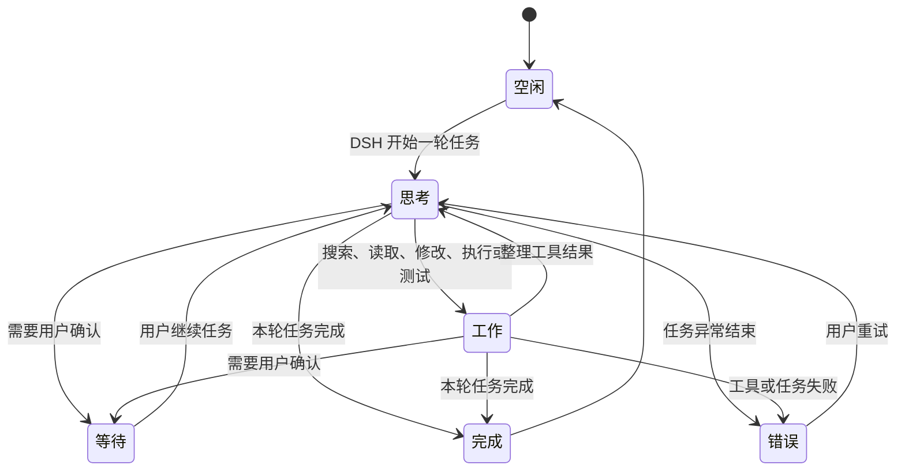

<div align="center">

# DSH 大肥鱼 🐋

**住在桌面上、由 DeepSeek Harness 真实工作状态驱动的 Agent 伴侣。**

入口属于 DSH，生命周期属于 DSH，显示层属于桌面。

[English](README_EN.md) · [npm](https://www.npmjs.com/package/dsh-dafeiyu) · [下载最新版本](https://github.com/QCYTSN/dsh-dafeiyu/releases) · [更新日志](CHANGELOG.md) · [更新与回退](docs/UPDATING.md) · [验收记录](docs/ACCEPTANCE.md) · [参考文献与移植说明](docs/REFERENCES.md)

[](https://www.npmjs.com/package/dsh-dafeiyu) · [](https://github.com/QCYTSN/dsh-dafeiyu/releases)

</div>


DSH 大肥鱼不是一个需要单独启动的桌宠应用。它由 DSH 插件启用，跟随 DSH
一起启动和退出，并以透明、无边框、始终置顶的原生窗口显示在桌面上。即使切换到
VS Code、浏览器或文件管理器，也能知道 DSH 当前在思考、修改、测试、等待还是已经完成。

> 当前版本：`0.1.15` · Windows / WSL2 / Linux x64 · macOS 实验性支持

## 关注最新进展

- 最新版本永远以 [npm `latest`](https://www.npmjs.com/package/dsh-dafeiyu) 和 [GitHub Releases](https://github.com/QCYTSN/dsh-dafeiyu/releases) 为准（Releases 里同时提供 `.tgz` 安装包）；顶部的版本徽章会自动更新。
- 给仓库 **Star 只是收藏，不会收到更新通知**。想第一时间知道「更新了什么」：
    1. 打开仓库点 **Watch → Custom → Releases**，只订阅 Release 通知；
    2. 或直接订阅 Releases 的 feed：<https://github.com/QCYTSN/dsh-dafeiyu/releases.atom>
- 已安装用户升级：完全退出 DSH 后执行
  ```powershell
  dsh plugin --profile web update dsh-dafeiyu
  ```
  然后重新启动 DSH 即可。

## 它有什么用？

- **离开 DSH 页面也能看到状态**：大肥鱼始终显示在桌面最上层。
- **反馈来自真实 Agent 事件**：不会读取屏幕，也不会把你在其他软件里的操作误判为 DSH 工作。
- **显示真实推理强度**：当 DSH 提供请求实际采用的 reasoning effort 时，状态详情会持续显示该值，不会根据模型名称自行猜测。
- **展示足够但不过量的信息**：项目名、当前阶段、正在进行的步骤和真实待办进度会显示在状态卡上。
- **有生命力但不打扰**：思考、查找、修改、执行、验证、等待、完成和错误都有对应动作与自然文案。
- **没有第二套应用入口**：无需单独运行 Helper、安装 Python或配置额外端口。

如果 DSH 没有提供待办清单，大肥鱼只显示“分析阶段”“实现阶段”“验证阶段”等可靠信息，
不会编造完成百分比。

## 状态展示

| 思考 | 工作 |
| --- | --- |
|  |  |

| 等待确认 | 完成 |
| --- | --- |
|  |  |

| 遇到问题 |
| --- |
|  |

状态大致按照下面的流程变化：



多个 DSH Session 同时运行时，默认优先展示最需要注意的顶层任务：

`等待确认 > 错误 > 工作 > 思考 > 空闲`

当有多个活动任务时，状态气泡会同时列出这些任务的状态。

## 系统要求

- Windows 10/11 x64，或 WSL2（通过 Windows interop 运行桌面 Helper）
- Linux x64 桌面（glibc ≥ 2.35；桌面实机仅在 Ubuntu 24.04 / glibc 2.39 验证）
- macOS 12.0+（Apple Silicon 或 Intel，实验性支持）
- 已安装并能正常运行的 DeepSeek Harness WebUI
- DSH CLI 中可以使用 `plugin --profile web` 命令
- npm 上的稳定版 `dsh-dafeiyu`（或抢先测试的 `dsh-dafeiyu@alpha`），或 GitHub Release 中的 `.tgz` 安装包

普通 Windows/Linux 用户**不需要**安装 Python、PySide6 或单独运行 Helper，预构建
Helper 已包含在发布包里。macOS 仍是实验性 Python/PySide6 路径，见下方说明。

当前 Alpha 版的设置与桌面状态文案使用简体中文。

## 安装插件

### 1. 完全退出 DSH

先关闭 DSH Host，而不只是关闭浏览器标签页。安装或更新时不要让旧版插件继续运行。

### 2. 命令安装

### Windows 用户

在 PowerShell 中进入你的 DSH 安装目录，例如：

```powershell
cd D:\DSH
```

然后从 npm 安装稳定版：

```powershell
pnpm dsh plugin --profile web add dsh-dafeiyu
```

如果你的系统已经能直接使用全局 `dsh` 命令，只需要：

```powershell
dsh plugin --profile web add dsh-dafeiyu
```

想抢先试用新功能（`@alpha` 测试版）的用户，把命令里的包名换成 `dsh-dafeiyu@alpha` 即可。

如果 DSH 运行在 WSL2，请在 WSL 终端执行同一条安装命令。可视模式下插件会
自动通过 `cmd.exe` 启动包内的 **Windows** Helper，不需要手动 `chmod`，
也不需要在 WSL 安装 Python 或 PySide6。原生 Linux 桌面请看下一节，使用
随包的 Linux Helper，而不是 Windows 的 `.exe`。

### Linux 用户（x64 桌面，glibc ≥ 2.35）

Linux 桌面的安装方式与 Windows 相同，只是换成终端和 Linux 路径。发布包
内置预构建 Helper，**不需要安装 Python 或 PySide6**。

系统要求：

- x86_64 桌面发行版，**glibc ≥ 2.35**（官方二进制在 Ubuntu 22.04 上构建）。
- **桌面实机目前只在 Ubuntu 24.04（glibc 2.39）上验证过。** Ubuntu 22.04 及其他发行版
  尚未做桌面验收；CI 只在 Ubuntu 22.04 上用 Xvfb 做构建与烟测。
- 需要图形会话（`DISPLAY` 或 `WAYLAND_DISPLAY`）。Helper 优先走 X11 / XWayland
  （`xcb`），其次才是 Wayland。
- Debian / Ubuntu 桌面通常还需要 `libxcb-cursor0`。
- ARM、无显示器的远程 SSH、容器和纯服务器环境不是本版本的桌面显示目标。

在终端中进入你的 DSH 安装目录（例如 `~/deepseek-harness`）：

```bash
cd ~/deepseek-harness
```

然后从 npm 安装稳定版：

```bash
pnpm dsh plugin --profile web add dsh-dafeiyu
```

也可以从 [GitHub Releases](https://github.com/QCYTSN/dsh-dafeiyu/releases)
下载 `dsh-dafeiyu-<version>.tgz`（不要解压），然后安装：

```bash
pnpm dsh plugin --profile web add ~/Downloads/dsh-dafeiyu-<version>.tgz
```

装完照常启动 DSH WebUI，大肥鱼会由 DSH 自动拉起；不需要手动打开 Helper。

### macOS 用户（Apple Silicon / Intel，macOS 12.0+）

> `0.1.4` 首次提供实验性的原生 macOS Helper。CI 已验证 Universal 架构、
> AppKit 渲染和进程生命周期；Apple Silicon 实机体验将继续通过用户反馈验证。
> 当前应用只有 ad-hoc 签名，尚未 Developer ID 签名或公证。Gatekeeper 只在
> 个别场景触发，放行方式见下方「关于 macOS Gatekeeper」。

macOS 的安装方式与 Windows 相同，只是换成「终端」和 macOS 路径。发布包
内置实验性桌面 Helper，但当前可视路径仍由 Python/PySide6 运行；请先准备
Python 3.11+ 和 `requirements.txt` 中的 PySide6。普通 Windows/Linux 用户不需要
这些运行时依赖。

在「终端」中进入你的 DSH 安装目录（例如 `~/deepseek-harness`）：

```bash
cd ~/deepseek-harness
```

然后从 npm 安装稳定版：

```bash
pnpm dsh plugin --profile web add dsh-dafeiyu
```

如果系统已经能直接使用全局 `dsh` 命令：

```bash
dsh plugin --profile web add dsh-dafeiyu
```

也可以从 [GitHub Releases](https://github.com/QCYTSN/dsh-dafeiyu/releases)
下载 `dsh-dafeiyu-<version>.tgz`（不要解压），然后安装：

```bash
pnpm dsh plugin --profile web add ~/Downloads/dsh-dafeiyu-<version>.tgz
```

装完照常启动 DSH WebUI，大肥鱼会由 DSH 自动拉起；不要手动打开 Helper。

#### 关于 macOS Gatekeeper

实测结论（见 issue [#24](https://github.com/QCYTSN/dsh-dafeiyu/issues/24)）：
从 npm 安装、用终端下载、以及浏览器下载 `.tgz` 后**直接安装**，都不会触发
Gatekeeper 拦截。只有用 Finder 解压出来的 `.app` 才会携带隔离标记，双击时
被拦截。

- 推荐做法：浏览器下载 `.tgz` 后**不要用 Finder 解压**，直接执行上面的安装
  命令（npm/tar 解包不传播隔离标记）。
- 用终端下载从一开始就不会产生隔离标记：

  ```bash
  gh release download --repo QCYTSN/dsh-dafeiyu
  # 或者
  curl -LO https://github.com/QCYTSN/dsh-dafeiyu/releases/download/v<版本>/dsh-dafeiyu-<版本>.tgz
  ```

- 如果已经用 Finder 解压并被拦截：右键该 Helper →「打开」放行一次，或者
  清除隔离标记后运行：

  ```bash
  xattr -dr com.apple.quarantine <解压出的 DSH.app 路径>
  ```

### 3. GitHub Release 备用安装方式

进入 [GitHub Releases](https://github.com/QCYTSN/dsh-dafeiyu/releases)，下载最新的：

```text
dsh-dafeiyu-<version>.tgz
```

不要解压这个文件。

不解压，在 DSH 目录中直接安装下载的插件包：

```powershell
pnpm dsh plugin --profile web add "C:\Users\you\Downloads\dsh-dafeiyu-<version>.tgz"
```

### 4. 启动 DSH

照常启动 DSH WebUI。插件默认启用，大肥鱼会由 DSH 自动拉起；不要手动打开 Helper。

### 5. 找到设置入口

在 DSH WebUI 中进入：

```text
设置 → 插件 → 插件配置 → 大肥鱼桌面伴侣
```


## 怎么使用？

安装后不需要额外操作：

1. 启动 DSH。
2. 在 DSH 中开始一个项目任务。
3. 大肥鱼根据 DSH 的真实事件切换动作和状态卡。
4. 切换到其他窗口继续工作；大肥鱼仍然保持在桌面最上层。
5. DSH Host 真正退出后，大肥鱼自动退出。

状态卡可能显示：

- 项目目录名称，例如 `dsh-dafeiyu`
- 当前阶段，例如“分析阶段”“实现阶段”“验证阶段”
- 当前待办，例如“完善项目文档”
- 真实进度，例如“已完成 3/5 步”
- 等待、完成或错误提示

大肥鱼不会监听 VS Code、浏览器或其他应用，也不会截图。只有 DSH Agent 的事件能够
改变它的工作状态。

## 可配置项目

| 设置 | 作用 |
| --- | --- |
| 启用大肥鱼 | 立即显示或关闭桌面伴侣 |
| 角色大小 | 在 55%～140% 之间调整；右键菜单提供 60% 迷你档 |
| 气泡大小 | 在 80%～120% 之间调整状态气泡，兼顾信息可读性 |
| 气泡显示 | 常驻显示、完全隐藏，或自定义哪些状态显示气泡 |
| 活跃程度 | 控制空闲时眨眼、观察等微动作频率 |
| 减少动态效果 | 减少走动、循环帧和程序化晃动 |
| 提示音 | 控制任务完成或出错时的大肥鱼提示音 |
| 响应子 Agent | 允许子 Agent 状态参与优先级选择；默认关闭 |

设置由 DSH 保存，更新插件后通常不需要重新配置。

## 桌面互动

- **拖动**：按住大肥鱼移动位置，位置会自动保存；松手后会依次出现弹开、晕乎和抗议的短反馈，开启“减少动态”时自动跳过。
- **点击或双击**：触发摸头、戳一下、尾巴等短互动，之后恢复最新 DSH 状态。
- **右键菜单**：调整大小、气泡大小、减少动态、打开 WebUI、本次隐藏或本次关闭。
- **本次隐藏**：只隐藏窗口，不禁用插件。
- **本次关闭**：关闭当前 Helper，本次 DSH 运行期间不会自动重启；下次启动 DSH 会再次出现。

## 更新插件

GitHub 仓库出现新提交后，已经安装的插件**不会自动变化**。新版本发布后，完全退出
DSH，然后更新 npm 稳定版包：

```powershell
cd D:\DSH
pnpm dsh plugin --profile web update dsh-dafeiyu
```

也可以再次执行安装命令，它会解析 npm `latest` 标签指向的新版本：

```powershell
pnpm dsh plugin --profile web add dsh-dafeiyu
```

使用 `@alpha` 测试版的用户，把更新命令里的包名换成 `dsh-dafeiyu@alpha` 即可。

使用 GitHub Release 安装的用户，可以下载新 `.tgz` 后覆盖安装：

```powershell
pnpm dsh plugin --profile web add "C:\Users\you\Downloads\dsh-dafeiyu-<new-version>.tgz"
```

以上方式都会替换插件及随包携带的 Helper，并保留 DSH 已保存的设置。详细
说明见 [插件更新与回退](docs/UPDATING.md)。

## 回退到旧版本

完全退出 DSH，重新安装之前保留的旧版 `.tgz`：

```powershell
cd D:\DSH
pnpm dsh plugin --profile web add "C:\Users\you\Downloads\dsh-dafeiyu-<old-version>.tgz"
```

## 卸载插件

完全退出 DSH 后运行：

```powershell
cd D:\DSH
pnpm dsh plugin --profile web remove dsh-dafeiyu
```

然后重新启动 DSH。插件代码和 Helper 会从 `web` profile 中移除。DSH 可能保留一份
不会再生效的历史设置，这不会启动进程或占用额外端口。

## 常见问题

<details>
<summary><strong>安装后没有看到大肥鱼</strong></summary>

1. 确认安装使用的是 `--profile web`。
2. 完全退出并重新启动 DSH Host。
3. 进入“设置 → 插件 → 插件配置”确认“启用大肥鱼”已经勾选。
4. 确认使用包含对应平台预构建 Helper 的发布包，而不是只克隆了缺少预构建 Helper 的源码。
   Windows / WSL2 需要 `runtime/bin/win32-x64`；原生 Linux 桌面需要
   `runtime/bin/linux-x64`；macOS 需要 `runtime/bin/darwin`。

</details>

<details>
<summary><strong>关闭了 DSH 网页，为什么大肥鱼还在？</strong></summary>

大肥鱼绑定的是 DSH Host 生命周期，而不是浏览器标签页。只要 DSH 后台仍在运行，
大肥鱼就会继续显示；真正退出 DSH Host 后它会自动关闭。

</details>

<details>
<summary><strong>为什么没有显示数字进度？</strong></summary>

只有 DSH 写入了结构化待办时，插件才能可靠计算“已完成 3/5 步”。没有真实待办数据时，
状态卡只显示当前工作阶段，避免制造虚假的百分比。

</details>

<details>
<summary><strong>右键选择“本次关闭”后为什么没有自动回来？</strong></summary>

这是预期行为。“本次关闭”会抑制当前 DSH 运行期间的自动重启；完全退出并重新启动
DSH 后会恢复。若想永久关闭，请在 DSH 设置中取消“启用大肥鱼”。

</details>

## 隐私与边界

- 不读取或保存模型 API Key
- 不截图，不读取其他窗口内容
- 不发送遥测
- 不监听键盘输入或其他应用行为
- 不新开网络端口；设置卡复用 DSH 的本地 Web 服务
- 默认只跟随最近活跃的顶层 DSH Session

## macOS 原生适配（AI 辅助生成）

> **说明**：本仓库的 macOS 适配仍标为实验性。当前 `src/helper-process.js`
> 选择单一的 `runtime/helper.py` 可视 Helper；`native/macos/` 下的 Swift
> 实现保留为核心逻辑、布局和 AppKit 试验代码，并不会与 Python Helper 并行启动。

### 重做了哪些地方

- **单一运行时**：桌面窗口和动画状态机继续由 `runtime/helper.py` 负责，避免
  Swift 与 Python 两套窗口同时出现而产生重复桌宠或残影。
- **Swift 核心验证**：`native/macos/` 保留 AppKit 窗口、动画状态机、布局迁移和
  交互物理的实现及 `swift test` 用例，作为后续原生化工作的可复现基线。
- **稳定性边界**：Helper 的 stdin/stdout/stderr 有 EPIPE 兜底；Helper 崩溃只由
  宿主重启自身，不把异常传播到 DSH 主进程。

### 兼容性

- **架构**：Universal binary（Apple Silicon arm64 + Intel x86_64）
- **系统**：macOS 12.0+
- 目前 macOS 仍需按 [参考文献与跨平台移植说明](docs/REFERENCES.md) 中的实验性边界使用。

## 开发与测试

## Codex 桌宠模式（macOS）

如果希望大肥鱼跟随 ChatGPT/Codex 桌面端启动和退出，安装本仓库附带的生命周期观察器：

```bash
npm run build:helper:darwin
npm run companion:install
```

它注册一个不显示窗口的 LaunchAgent 观察器：只有检测到 ChatGPT.app 运行时才启动大肥鱼
和 Codex `app-server`；ChatGPT.app 退出后会关闭二者。大肥鱼状态卡下方有输入框，提交
内容直接发送到 Codex app-server 的 thread/turn，不经过额外的模型接口或本地 HTTP 服务。
卸载观察器：`npm run companion:uninstall`。

```powershell
pnpm install
npm test
py -3 -m unittest discover -s runtime/tests -t .
```

开发时可以从源码运行 Helper，但正式用户不应手动启动它：

```powershell
py -3 -m pip install -r requirements.txt
py -3 runtime\helper.py
```

构建 Windows Helper：

```powershell
python -m pip install -r requirements.txt pyinstaller
$env:DSH_DAFEIYU_BUILD_PYTHON = (Get-Command python).Source
npm run build:helper:windows
```

构建 Linux Helper（需在 Linux x86_64 上；官方发布在 Ubuntu 22.04 上构建，
以保证 glibc 2.35 基线）：

```bash
python3 -m pip install -r requirements.txt pyinstaller
export DSH_DAFEIYU_BUILD_PYTHON="$(command -v python3)"
npm run build:helper:linux
```

macOS 原生 Helper 的构建说明见 [native/macos/README.md](native/macos/README.md)。

## 更多文档

- [产品范围与取舍](docs/PRODUCT_SCOPE.md)
- [Windows 验收与性能记录](docs/ACCEPTANCE.md)
- [更新、回退与卸载](docs/UPDATING.md)
- [维护者发布流程](docs/RELEASING.md)
- [参考文献与跨平台移植说明](docs/REFERENCES.md)
- [角色视觉资产许可](ASSET_LICENSE.md)

相关项目：[QCYTSN/ds-local-pet](https://github.com/QCYTSN/ds-local-pet) 是独立桌宠版本；
本仓库是只服务于 DSH 状态的插件版本。

## License

代码采用 [MIT License](LICENSE)。

当前角色动画素材（`assets/pet/`）来自社区项目
[dsh-pet](https://github.com/PC2005-cloud/dsh-pet)（Copyright © 2026
PC2005-cloud，MIT 许可）：我们按其 MIT 条款精选导入了 16 个动画并重新编码，
上游许可证原文随包发布（`assets/dsh-pet-LICENSE.txt`）。感谢 dsh-pet 作者
贡献的高质量素材与公开的 AI 生成配方。

早期大肥鱼形象帧已归档至 `legacy/dafeiyu/`（不再随包发布），其原始
受限条款继续适用。完整来源与使用边界见 [ASSET_LICENSE.md](ASSET_LICENSE.md)。
